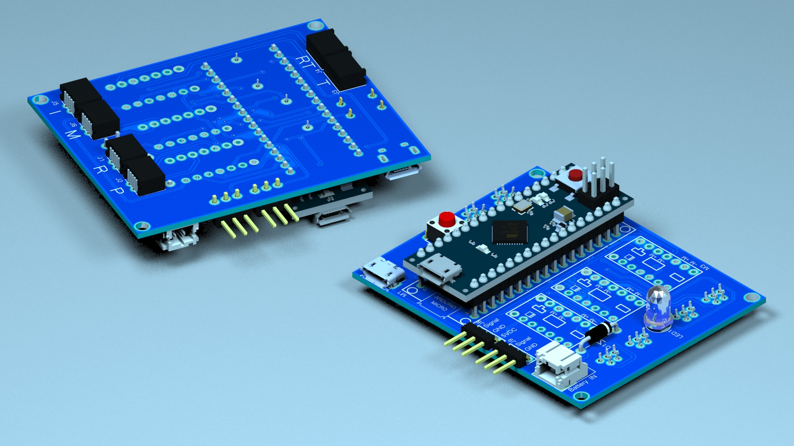

## Youbionic

## Table of Contents

- [3d Model Assembly](#3d-model-assembly)
- [3d Printing](#3d-printing)
- [Actuators](#actuators)
- [Arduino Code](#arduino-code)
- [Handbook - Assembly Instructions](#handbook-assembly-instructions)
- [Technical Drawing](#technical-drawing)
- [Wiring Diagrams](#wiring-diagrams)

### 3d Model Assembly
### 3d Printing
### Actuators
### Arduino Code
### Handbook - Assembly Instructions
### Technical Drawing

### Wiring Diagrams

- <object data="assets/wiring-diagrams/gerber-view.pdf" type="application/pdf" width="700px" height="700px">
    <embed src="assets/wiring-diagrams/gerber-view.pdf">
        
<a href="assets/wiring-diagrams/gerber-view.pdf">Gerber View</a>

    </embed>
</object>
- <object data="assets/wiring-diagrams/pcb-view.pdf" type="application/pdf" width="700px" height="700px">
    <embed src="assets/wiring-diagrams/pcb-view.pdf">
        
<a href="assets/wiring-diagrams/pcb-view.pdf">PCB View</a>

    </embed>
</object> 
- <object data="assets/wiring-diagrams/schematic-v2.pdf" type="application/pdf" width="700px" height="700px">
    <embed src="assets/wiring-diagrams/schematic-v2.pdf">
        
<a href="assets/wiring-diagrams/schematic-v2.pdf">Schematic View</a>

    </embed>
</object>

## License

Released under [the MIT license](LICENSE).
